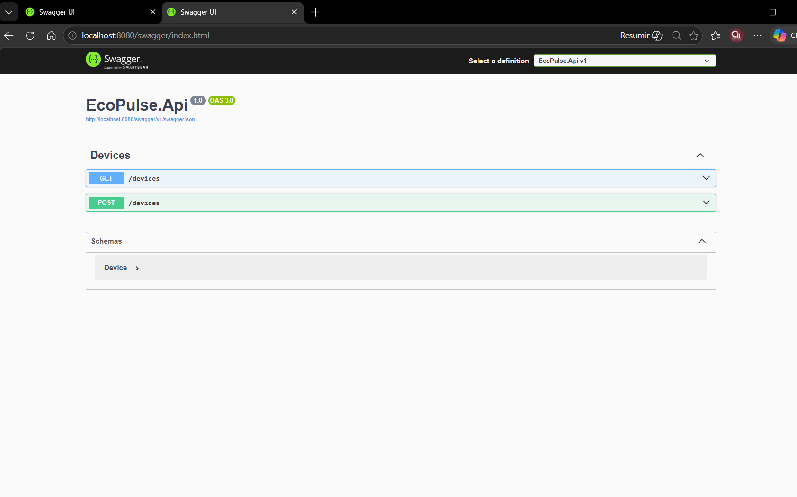
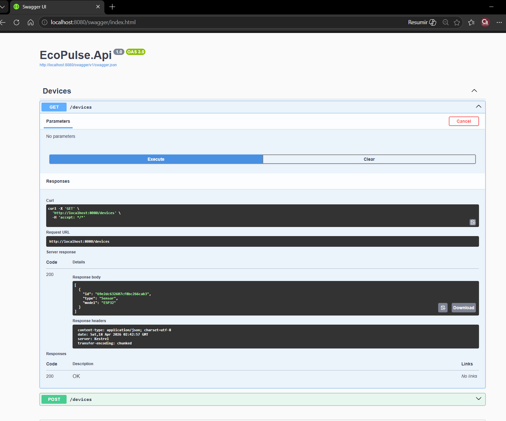
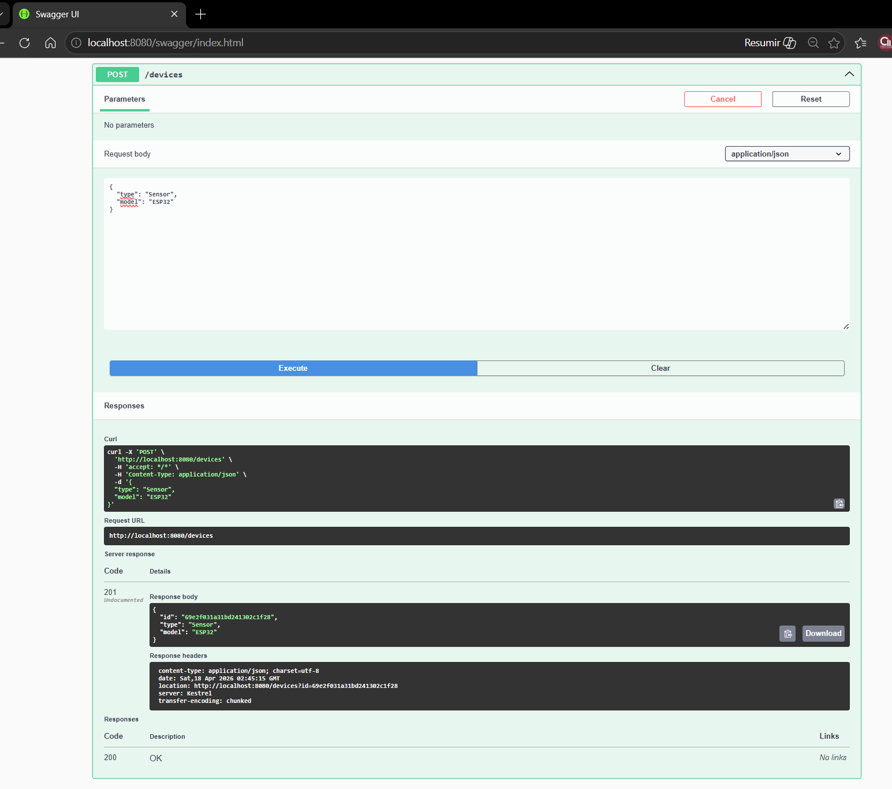
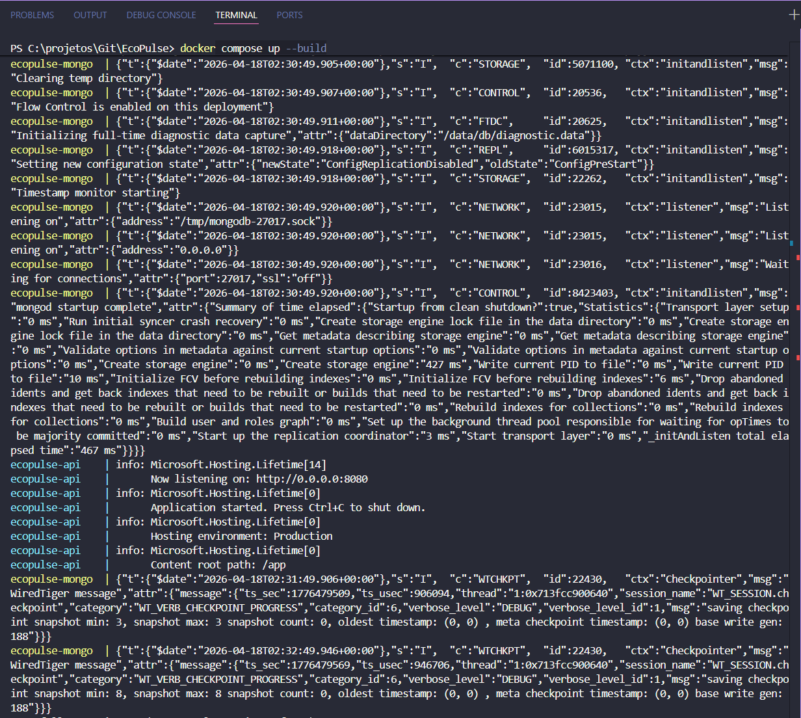
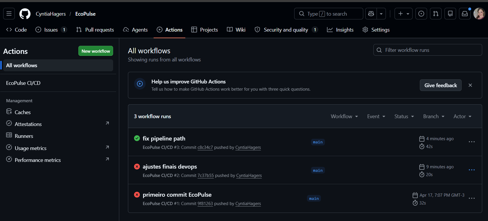

# 🌱 Projeto - Cidades ESG Inteligentes (EcoPulse)

## 📌 Descrição

O **EcoPulse** é uma API desenvolvida em **.NET 8 com MongoDB**, com foco em soluções para cidades inteligentes no contexto ESG (Environmental, Social and Governance).

A aplicação permite o gerenciamento de dispositivos (devices), como sensores ambientais, possibilitando monitoramento e futura análise de dados urbanos.

---

## 🚀 Como executar localmente com Docker

### 🔧 Pré-requisitos

* Docker Desktop instalado
* Docker Compose

---

### ▶️ Passos

```bash
# Clonar o repositório
git clone <URL_DO_REPOSITORIO>

# Acessar a pasta do projeto
cd EcoPulse

# Subir a aplicação
docker compose up --build

# Parar os containers
docker compose down
```

---

### 🌐 Acessar a API

Swagger:

```
http://localhost:8080
```

---

## ⚙️ Pipeline CI/CD

Foi implementado um pipeline utilizando **GitHub Actions**, com as seguintes etapas:

### 🔁 Fluxo do Pipeline

1. **Checkout do código**
2. **Configuração do .NET 8**
3. **Restore de dependências**
4. **Build da aplicação**
5. **Execução de testes**
6. **Build da imagem Docker**
7. **Preparação para deploy automatizado**

---

### 🌍 Ambientes

* **Staging** → branch `staging`
* **Produção** → branch `main`

O deploy foi simulado com base na branch, representando um fluxo real de CI/CD.

---

## 🚀 Deploy

O deploy foi configurado de forma automatizada no pipeline CI/CD.

Foram definidos dois ambientes:

- **Staging** → ativado quando há push na branch `staging`
- **Produção** → ativado quando há push na branch `main`

O processo de deploy foi **simulado**, conforme escopo da atividade, representando um fluxo real de entrega contínua.

---

## 🐳 Containerização

### 📄 Dockerfile (Multi-stage build)

A aplicação foi containerizada utilizando **multi-stage build**, uma estratégia que permite separar o processo de build da execução da aplicação.

Isso traz benefícios como:

* Redução do tamanho da imagem final
* Melhor organização do processo de build
* Maior segurança (sem dependências desnecessárias em produção)

### 🔍 Etapas do Dockerfile

1. **Build da aplicação**
   - Utiliza a imagem `dotnet/sdk`
   - Restaura dependências e compila o projeto

2. **Imagem final (runtime)**
   - Utiliza a imagem `dotnet/aspnet`
   - Copia apenas os arquivos necessários para execução

### 🧾 Código

```dockerfile
FROM mcr.microsoft.com/dotnet/sdk:8.0 AS build
WORKDIR /src
COPY . .
WORKDIR /src/src/EcoPulse.Api
RUN dotnet restore
RUN dotnet publish -c Release -o /app/out

FROM mcr.microsoft.com/dotnet/aspnet:8.0
WORKDIR /app
COPY --from=build /app/out .
ENTRYPOINT ["dotnet", "EcoPulse.Api.dll"]

```

### 🧩 Docker Compose

O ambiente foi orquestrado com:

* **API (.NET)**
* **Banco de dados MongoDB**

Inclui:

* Rede compartilhada
* Variáveis de ambiente
* Volume para persistência de dados

---

## 📡 Endpoints da API

### 🔹 GET /devices

Lista todos os dispositivos cadastrados

### 🔹 POST /devices

Cria um novo dispositivo

#### Exemplo de requisição:

```json
{
  "type": "Sensor",
  "model": "ESP32"
}
```

---

## 🧪 Testes da API

Os testes podem ser realizados via:

* Swagger UI
* Postman
* cURL

---

## 🖼️ Prints do funcionamento

### 🔹 Swagger funcionando


---

### 🔹 GET /devices funcionando


---

### 🔹 POST /devices funcionando


---

### 🔹 Docker rodando (containers)


---

### 🔹 Pipeline CI/CD (GitHub Actions)


---

## 🧱 Arquitetura do Projeto

```
EcoPulse
│
├── .github/workflows
├── src/EcoPulse.Api
│   ├── Controllers
│   ├── Models
│   ├── Services
│   ├── Program.cs
│
├── Dockerfile
├── docker-compose.yml
├── .env
├── .env.example
└── README.md
```

---

## 🛠 Tecnologias Utilizadas

* .NET 8 (ASP.NET Core)
* MongoDB
* Docker
* Docker Compose
* GitHub Actions
* Swagger (OpenAPI)

---

## ⚠️ Desafios Encontrados

* Configuração de portas e acesso via Docker
* Integração com MongoDB via variáveis de ambiente
* Configuração do Swagger em ambiente containerizado
* Ajuste de validação de modelo no POST
* Build e execução de imagens Docker corretamente

---

## ✅ Soluções Aplicadas

* Uso de `0.0.0.0` para permitir acesso externo ao container
* Configuração de `RoutePrefix` no Swagger
* Criação de `.env` para variáveis sensíveis
* Estruturação em camadas (Controller, Service, Model)
* Pipeline automatizado via GitHub Actions

---

## 📌 Observações

* O deploy foi simulado conforme exigido na atividade
* A aplicação está preparada para evolução para ambientes reais

---

## 📋 Checklist de Entrega

✔ Projeto compactado em .ZIP com estrutura organizada
✔ Dockerfile funcional
✔ docker-compose.yml
✔ Pipeline com etapas de build, teste e deploy
✔ README.md com instruções e prints
✔ Documentação técnica (PDF/PPT)
✔ Deploy simulado (staging e produção)

---

## 👨‍💻 Integrantes

* (Adicionar nomes aqui)
